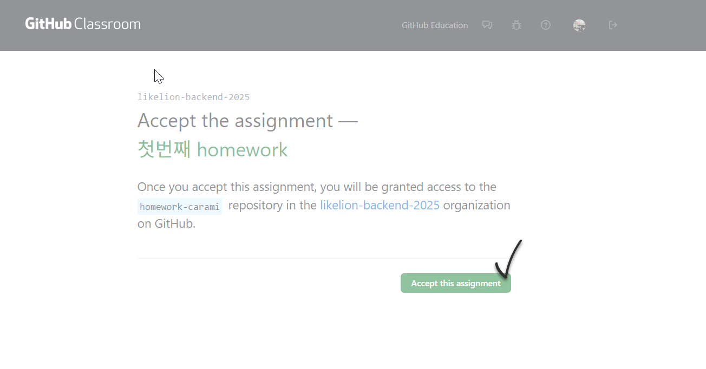
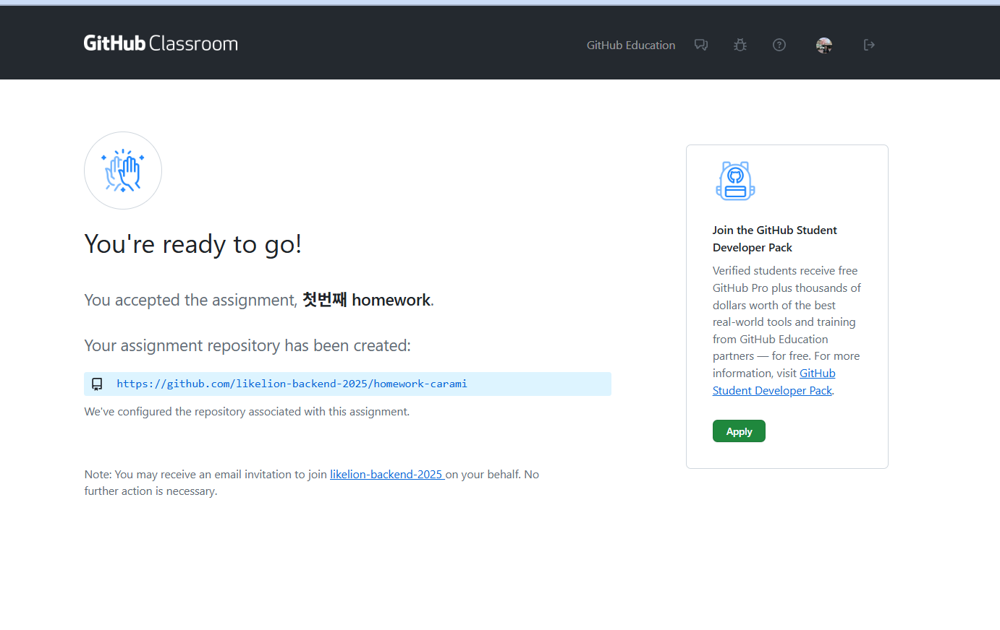

# GitHub Classroom 과제 제출 가이드

## 📋 과제 정보
- **과제명**: 첫번째 homework
- **제출 방식**: GitHub Classroom을 통한 온라인 제출
- **초대 링크**: https://classroom.github.com/a/X8ae3UrV

---

## 🚀 과제 제출 단계별 가이드

### 1단계: 과제 초대 링크 접속
위의 초대 링크를 클릭하여 GitHub Classroom 과제 페이지에 접속합니다.

### 2단계: 과제 수락하기

 

- 과제 페이지에서 **"Accept this assignment"** 버튼을 클릭합니다
- 과제를 수락하면 `homework-[본인계정명]` 형태의 개인 레포지토리가 자동으로 생성됩니다
- 생성된 레포지토리는 `likelion-backend-2025` 조직 내에 위치합니다


### 3단계: 개인 레포지토리 접근
- 과제 수락 후 몇 초 기다리면 개인 레포지토리 링크가 제공됩니다
- 해당 링크를 클릭하여 자신의 과제 레포지토리로 이동합니다




### 4단계: 과제 수행

#### 방법 1: 로컬에서 작업하는 경우
```bash
# 1. 레포지토리 클론
git clone [생성된 레포지토리 URL]
cd homework-[본인계정명]

# 2. 과제 수행 (파일 작성/수정)

# 3. 변경사항 커밋 및 푸시
git add .
git commit -m "과제 완료: [간단한 설명]"
git push origin main
```

---

## ⚠️ 주의사항

### ✅ 해야 할 것
- ✅ 반드시 제공된 초대 링크를 통해 과제를 수락해야 합니다
- ✅ 개인 레포지토리에서만 작업하세요
- ✅ 커밋 메시지를 명확하게 작성하세요 (예: "1번 문제 해결", "과제 완료")
- ✅ 과제 완료 후 최종 push가 성공했는지 GitHub에서 확인하세요
- ✅ README.md 파일에 과제 설명이나 실행 방법을 작성하세요

### ❌ 하지 말아야 할 것
- ❌ 다른 학생의 레포지토리에 접근하지 마세요
- ❌ 직접 조직에 레포지토리를 생성하지 마세요
- ❌ 과제 제출 후 레포지토리를 삭제하지 마세요
- ❌ 다른 학생의 코드를 복사하지 마세요

---

## 🔧 문제 해결

### "Accept this assignment" 버튼이 비활성화된 경우
1. 페이지를 새로고침(F5)해보세요
2. 다른 브라우저로 시도해보세요
3. GitHub에 로그아웃 후 다시 로그인해보세요
4. 브라우저의 캐시와 쿠키를 삭제해보세요
5. 그래도 안 되면 강사에게 문의하세요

### GitHub 계정이 없는 경우
1. [GitHub](https://github.com)에서 무료 계정을 생성하세요
2. 계정 생성 후 이메일 인증을 완료하세요
3. 다시 초대 링크로 접속하세요

### Git 명령어 관련 문제
```bash
# Git 사용자 정보 설정 (최초 1회)
git config --global user.name "본인이름"
git config --global user.email "본인이메일@example.com"

# 원격 저장소 URL 확인
git remote -v

# 현재 상태 확인
git status

# 커밋 히스토리 확인
git log --oneline
```

---

## 📞 도움이 필요한 경우

문제가 발생하거나 질문이 있으면 언제든지 강사에게 문의하세요.


---

## 📖 추가 참고 자료

- [GitHub 기본 사용법](https://docs.github.com/en/get-started)
- [Git 명령어 가이드](https://git-scm.com/docs)
- [Markdown 문법 가이드](https://guides.github.com/features/mastering-markdown/)